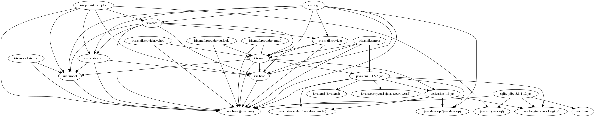

# iris-java9

__TODO:__ migrar o restante dos módulos relacionados a persistência. Apenas os módulos JDBC foram migrados.

__TODO:__ refatoracao basica no pom.xml da raiz (basicamente uma limpeza)

### Configurar o iris

Criar uma pasta _$HOME/.iris_

Copiar o arquivo _iris.properties_ (da raiz do projeto) para o diretório criado (_$HOME/.iris_)

Editar o arquivo _$HOME/.iris/iris.properties_ de acordo com as necessidades

### Configurar produtos

Cada produto deve ser configurado em um profile específico no 'projeto' _iris.produtos_

Já foram configurados 2 _produtos/profiles_ como exemplo (um CLI e outro GUI)

### Gerar artefatos

Na raiz do projeto executar: `mvn -P simple-cli` (trocando o _simple-cli_ pelo nome do profile)

### Executar produto

Por enquanto está sendo executado por script bash.

Se o produto gerado for CLI, executar o __run-cli.sh__

Se o produto gerado for GUI, executar o __run-gui.sh__

### Visualizar a hierarquia dos módulos

Executar o script _deps.sh_

Exemplo da imagem gerada para o produto _simple-gui_:

